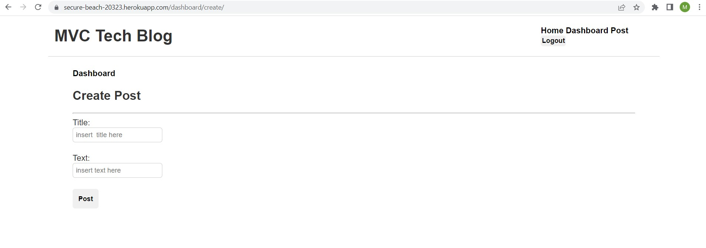

# techBlogMVC

## Model-View-Controller (MVC): Tech Blog

This application creates a CMS-style blog site that allows a user to publish articles, blog posts, thoughts, and opinions.

## Mock-up

## Installation

This application requires installation of npm (incl. nodemon, dotenv, express, mysql2, sequelize, express-handlebars), MySQL, and Heroku. 

A walkthrough video can be viewed here: GOOGLE DRIVE LINK

All elements of the project can be examined here: https://github.com/matthewestes33/techBlogMVC  

## Credits

Referenced documentation and tutorials:

Additional assistance:

Thank you to my instructional staff, weekly tutor, and AskBCS Learning Assistants!

## Features

When the user navigates to the homepage, the page includes existing blog posts if any have been posted, navigation links for the homepage and the dashboard, and the option to log in.

When the user clicks on the homepage option, they are taken to the homepage, but when the user clicks on any other links in the navigation, they are prompted to either sign up or sign in.

When the user chooses to sign up, they prompted to create user credentials, which are saved as the user is logged into the site

When the user revisits the site at a later time, they are prompted to enter their user credentials. 

When the user is signed in, they see navigation links for the homepage, the dashboard, and the option to log out.

When the signed-in user clicks on the homepage option in the navigation, they are taken to the homepage and presented with existing blog posts that include the post title and the date created.

When the signed-in user clicks on an existing blog post, they are presented with the post title, contents, post creator’s username, and date created for that post, and have the option to leave a comment.

When the signed-in user comments and clicks on the submit button, their comment is saved and the post is updated to display the comment, the comment creator’s username, and the date created.

When the signed-in user clicks on the dashboard option in the navigation, they are taken to the dashboard and presented with any blog posts they have already created and the option to add a new blog post.

When the signed-in user on the button to add a new blog post,they are prompted to enter title and contents for their blog post.

When the signed-in user clicks on the button to create a new blog post, the title and contents are saved and the user is taken back to an updated dashboard with my new blog post.

When the signed-in user clicks on an existing blog post in the dashboard, they are able to delete or update the post, and taken back to an updated dashboard.

When the signed-in user clicks logout option in the navigation, they are signed out of the site.

When the signed-in user is idle on the site for more than a set time, they are able to view comments, but are prompted to log in again before allowed to add, update, or delete comments.
